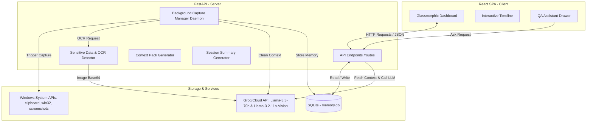

# Totem: Active Desktop Context Memory, Classifier & Sessions Dashboard

Totem is a premium, developer-centric active desktop productivity companion. It operates quietly in the background on your system to capture your active workspace context—including active application details, active window title, clipboard content, and periodic system screenshots. It leverages advanced Large Language Models (LLMs) via the Groq API (such as `llama-3.3-70b-versatile` and `llama-3.2-11b-vision-preview`) to automatically analyze, summarize, classify, and organize your work history into meaningful temporal **Work Sessions**, priority tasks, and interactive timeline graphs.

Totem lets you capture interaction history and instantly compile it into a unified **Context Pack**—a highly optimized system prompt designed to boot LLM chat sessions or quickly resume complex development tasks with the exact state and history of your active workspace.

---

## 🛠️ Tech Stack Used

Totem uses a modern, lightweight, and efficient decoupled architecture:

### Frontend
*   **React 19** & **Vite**: Single Page Application (SPA) framework for the dashboard.
*   **Vanilla CSS**: Custom-designed layout implementing a modern glassmorphism design system (vibrant glow, translucent cards, subtle gradients, and custom micro-animations).
*   **Axios**: For frontend-backend asynchronous HTTP communication.

### Backend
*   **FastAPI**: Modern, high-performance web framework for Python 3.8+ REST API routes.
*   **Uvicorn**: ASGI web server implementation for FastAPI.
*   **SQLAlchemy**: Object-Relational Mapper (ORM) using SQL expressions.
*   **SQLite**: Self-contained, lightweight serverless SQL database engine.
*   **PyGetWindow**: Windows-specific active window tracker.
*   **Pyperclip**: Cross-platform clipboard text capture.
*   **PyAutoGUI** & **Pillow (PIL)**: System screenshot capture and image processing.
*   **Groq SDK**: Official SDK to communicate with the Groq Cloud API.
*   **python-dotenv**: For loading environment configurations.

---

## 🚀 Setup Instructions

Follow these instructions to configure and launch Totem on your local Windows system.

### Prerequisites
*   **Python 3.8+**: Ensure Python is installed and added to your system environment variables.
*   **Node.js (v18+) & npm**: For running the Vite/React development server.

### 1. Configure the Groq API Key
1. Obtain an API key from the [Groq Console](https://console.groq.com/).
2. In the `backend/` directory, create a `.env` file (or edit the existing one).
3. Add your Groq API key:
   ```env
   GROQ_API_KEY=gsk_your_actual_groq_api_key_goes_here
   ```

### 2. Set Up the Backend Server
Open a command prompt or PowerShell window, navigate to the `backend/` directory, and run:
```powershell
# Navigate to backend
cd backend

# Create a Python virtual environment
python -m venv venv

# Activate the virtual environment
# On Windows PowerShell:
.\venv\Scripts\Activate.ps1
# On Windows CMD:
.\venv\Scripts\activate.bat

# Install required dependencies
pip install -r requirements.txt

# Run the FastAPI server via Uvicorn
uvicorn main:app --reload
```
The FastAPI backend server will start running at `http://127.0.0.1:8000`. Database migrations will automatically run on startup and create `memory.db` in the `backend/` directory.

### 3. Set Up the Frontend Client
Open a second terminal window, navigate to the `frontend/` directory, and run:
```bash
# Navigate to frontend
cd frontend

# Install Node modules
npm install

# Start the Vite React development server
npm run dev
```
Open `http://localhost:5173` in your web browser to access the Totem UI Dashboard!

---

## ✨ Features Implemented

### 🕒 Automatic Work Session Grouping
*   **Temporal Grouping**: Automatically clusters consecutive interaction memories captured within **30 minutes** of each other into a single, continuous work session. Interactions occurring after a gap of 30+ minutes automatically start a new session.
*   **Session Propagations**: Automatically updates `sessionEnd` timestamps for all memories in an active session when new captures are appended.
*   **Sequential IDs**: Session IDs are automatically generated in ascending order.
*   **Performance Cache**: Caches work session summaries in the SQLite database (`work_sessions` table). The cache is automatically invalidated and cleared whenever a new memory is captured/appended to an active session.
*   **AI Session Summary**: Generates structured, JSON summaries for each work session describing the **Main Objective**, **Work Completed**, **Decisions Made**, **Outstanding Issues**, and **Suggested Next Step** using Groq Llama 3.3.

### 🎛️ Interactive Glassmorphic UI Dashboard
*   **Multi-View Navigation**: Seamless tab-based navigation switching between the **Dashboard** and **Work Sessions** views.
*   **Timeline Search & Filter**: Real-time interactive keyword search and category dropdown filters on the memory timeline.
*   **Work Session Grid**: Displays detected work sessions in reverse-chronological order, showcasing duration, category breakdown, count of important items, and most-used applications.
*   **Chronological Session Timeline**: Vertical connected timeline view with glowing indicator nodes illustrating step-by-step progress.

### 🤖 Floating AI QA Assistant
*   **Context-Aware Chat Drawer**: A sliding chatbot drawer on the bottom-right corner of the dashboard where you can ask natural-language questions (e.g. *"What did I research about APIs earlier?"* or *"What bugs did I solve?"*).
*   **SQL-Driven Memory RAG**: Fetches user-recorded workspace memories from the SQLite database and passes them as prompt context to `llama-3.3-70b-versatile` to provide accurate, grounded responses.

### 🌟 Priority Memories & In-place Editing
*   **Star Icons**: Star memories with high importance. Toggling stars triggers visual feedback (amber/gold card highlights and scale animations).
*   **Inline Metadata Editing**: Edit memory titles and summaries in-place using pre-filled popup modals.
*   **Context Pack Prioritization**: Places starred memories at the very top of context packs with a `(Priority: Important)` label to draw immediate LLM attention.

### 🔒 Privacy Shield & Credentials Masking
*   **Multichannel Scanned Check**: Automatically scans capture data—including window titles, raw clipboard text, and screenshot text extracted using Vision OCR—for passwords, API keys (OpenAI, Groq, Google), private keys, and credit cards (validated via the Luhn algorithm).
*   **Automatic Masking**: Pre-masks sensitive matches with `[MASKED_API_KEY]`, `[MASKED_PASSWORD]`, or `[MASKED_FINANCIAL_INFO]` tokens before committing them to the database or passing them to the AI classification models.
*   **Confirmation Queue**: Automatically intercepts captures matching sensitive indicators and routes them to a **Pending Confirmations** dashboard section. Users review masked details to either **Confirm Save** or **Discard** them.

### 🐍 Continuous System Capture Daemon
*   **Auto-Capture Thread**: A FastAPI daemon thread executing context captures every 20 seconds.
*   **Self-Capture Protection**: Automatically ignores screenshots and window details from Totem itself to avoid infinite self-referential feedback loops.
*   **Dashboard Capture Control**: Pulsating toggle switches allow the user to pause, resume, or manually trigger a capture instantly on demand.

---

## 📐 Architecture Overview

Totem uses a modular, decoupled architecture consisting of an active client web shell, a FastAPI REST controller, and an independent capture thread manager operating on a local SQLite database.



### Data Flow
1. **Background Capture Loop**: Every 20 seconds, the `BackgroundCaptureManager` wakes up and queries the local Windows OS using PyGetWindow, Pyperclip, and PyAutoGUI.
2. **Privacy Filtering**: Before saving, the screenshot is sent to Groq's `llama-3.2-11b-vision-preview` to extract readable OCR text. If regex patterns or OCR contain credentials, the content is masked, and the record is marked `pending_confirmation = 1`.
3. **AI Classification**: Cleaned textual context (App, Window Title, and Clipboard) is sent to Groq's `llama-3.3-70b-versatile` with `CLASSIFICATION_PROMPT` to categorize, summarize, and tag the entry.
4. **Session Boundary Evaluation**: The system analyzes the gap between the new memory's timestamp and the last entry. If under 30 minutes, it appends it to the active `sessionId`, invalidates the cached session summary, and updates `sessionEnd` across all session components. If over 30 minutes, it registers a new sequential `sessionId`.
5. **Interactive UI Update**: The React frontend polls endpoints every 10 seconds to fetch newly confirmed memories, capture status, and pending sensitive confirmations.

### Database Schema (SQLite)

#### 1. `memories` Table
Tracks individual context captures.

| Column | Type | Description |
| :--- | :--- | :--- |
| `id` | INTEGER (PK) | Auto-incrementing unique memory ID. |
| `createdAt` | TEXT | ISO timestamp representing capture time. |
| `sourceApp` | TEXT | Executable name of the active application. |
| `windowTitle` | TEXT | Text title of the active application window. |
| `rawContext` | TEXT | Clipboard text content or context snippet. |
| `summary` | TEXT | AI-generated summary of the interaction. |
| `type` | TEXT | Category (e.g. Coding, Research, Bug, Decision). |
| `intent` | TEXT | User intent parsed by the classifier. |
| `topic` | TEXT | Core topic of the user interaction. |
| `tags` | TEXT | JSON string array of tags associated with the capture. |
| `sensitivity` | TEXT | Severity classification (Low, High). |
| `usefulnessScore`| FLOAT | Value indicator assigned by classifier. |
| `suggestedNextAction` | TEXT | Suggested next action parsed by classifier. |
| `screenshot` | TEXT | Filepath to the captured screenshot. |
| `pending_confirmation` | INTEGER | Flag (1 = pending approval due to sensitivity, 0 = confirmed). |
| `sensitivityReason` | TEXT | Reasoning detail why the item was flagged as sensitive. |
| `title` | TEXT | AI-generated short title for the memory block. |
| `isImportant` | BOOLEAN | Priority star indicator. |
| `sessionId` | TEXT | Identifier grouping related memories. |
| `sessionStart` | TEXT | Starting timestamp of the parent session. |
| `sessionEnd` | TEXT | End timestamp of the parent session. |

#### 2. `work_sessions` Table
Caches summaries generated by LLM analysis.

| Column | Type | Description |
| :--- | :--- | :--- |
| `sessionId` | TEXT (PK) | Reference identifier corresponding to grouped memories. |
| `summary` | TEXT | JSON string cache containing summary metrics and bullet lists. |

---

## ⚠️ Known Limitations

*   **OS Restriction**: Currently supports Windows platforms only. Core window-tracking libraries (such as `pygetwindow`) rely on Microsoft Windows APIs. Active application title extraction varies across platforms.
*   **OCR Latency**: Sending screenshots to the `llama-3.2-11b-vision-preview` cloud model for vision OCR introduces a network roundtrip of 1-3 seconds on every capture cycle.
*   **Single-Display Bounds**: Screenshots taken via `pyautogui.screenshot()` capture the primary display window only, ignoring activity occurring on auxiliary/extended monitors.
*   **Transient Clipboard Capture**: Polling capture only evaluates the clipboard when the daemon wakes up (every 20 seconds). It may miss clipboard texts copied and replaced within that 20-second gap.

---

## 🔮 Future Improvements

*   **Cross-Platform Portability**: Port active window and application detection hooks to use cross-platform frameworks (like `pywinctl`) or macOS and Linux platform scripts.
*   **Offline / Local LLM Integration**: Support local runtime configurations (e.g. Ollama, ONNX, or Llama.cpp) to run text classification and vision OCR locally, eliminating cloud latency and ensuring absolute offline privacy.
*   **Dual OCR Engine Pipeline**: Implement a fast, local OCR processor (such as Tesseract OCR) to instantly scan screenshots, reserving Groq Vision models strictly for complex UI components or rich text extraction when local scans fail.
*   **Multi-Monitor Context Capture**: Upgrade screen capture pipelines to merge active displays or selectively target the monitor containing the active mouse cursor/active application window.
*   **Custom Session Rules**: Expose configuration settings in the Dashboard UI to allow users to modify active session timeouts (e.g., changing the gap from 30 minutes to 15 or 60 minutes) and toggle auto-capture frequency dynamically.
